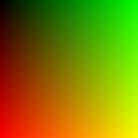

# Colors --- Advanced Guide (With Images)

## Rang nima?

Rang --- bu yorug'likning to'lqin uzunligi orqali ko'rinadigan hodisa.
Ekranlarda rang **RGB modeli**, chop etishda esa **CMYK modeli** orqali
ko'rsatiladi.

------------------------------------------------------------------------

## Rang turlari

### **1. Primary Colors (Asosiy ranglar)**

-   RGB: Red, Green, Blue\
-   CMYK: Cyan, Magenta, Yellow (Key/Black)

### **2. Secondary Colors**

Asosiy ranglarning aralashuvidan hosil bo'ladi.

### **3. Tertiary Colors**

Secondary + Primary aralashuvchi oraliq ranglar.

------------------------------------------------------------------------

## Rang Shkalasi (Color Scale)

Rang shkalasi --- rangning **quyidagi o'zgarishlari**ni ko'rsatadi: -
Hue (rang turi) - Saturation (to'yinganlik) - Lightness (yorqinlik)

Quyida oddiy rang gradienti:

------------------------------------------------------------------------

## RGB Modeli qanday ishlaydi?

RGB --- ekrandagi asosiy rang tizimi:

-   R → Qizil\
-   G → Yashil\
-   B → Ko'k

Mana oddiy ko'rsatkich diagrammasi:

------------------------------------------------------------------------

## Rang qachon o'zgaradi?

Rang quyidagi holatlarda o'zgaradi:

### **1. Yorqinlik (Lightness) o'zgarishi**

Rang ochiq yoki to'q bo'lib ko'rinadi.

### **2. To'yinganlik (Saturation) o'zgarishi**

Rang xira → to'q bo'ladi.

### **3. Rang turi (Hue) o'zgarishi**

Masalan: qizil → sariq → yashil → ko'k → binafsha

### **4. Yoritish manbasi o'zgarishi**

Issiq yorug'lik / sovuq yorug'lik rangni o'zgartiradi.

### **5. Orqa fon ta'siri**

Rang boshqa rang yonida boshqacha ko'rinadi (Color Perception Effect).

------------------------------------------------------------------------

## Xulosa

Rang --- juda murakkab psixologik va fizikaviy hodisa. Uning o'zgarishi:

-   Hue\
-   Saturation\
-   Lightness\
-   Light source\
-   Background

parametrlari orqali sodir bo'ladi.

------------------------------------------------------------------------
